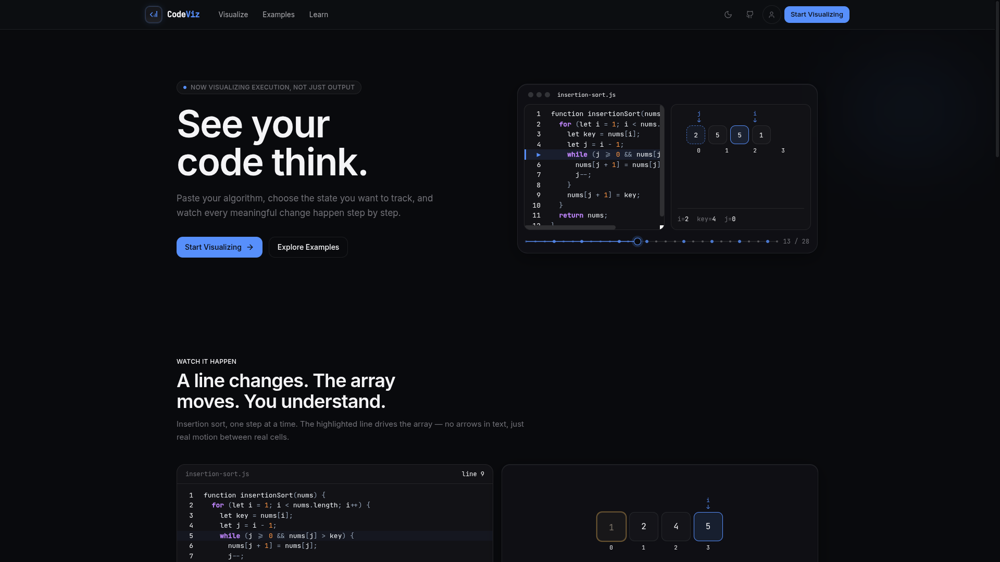
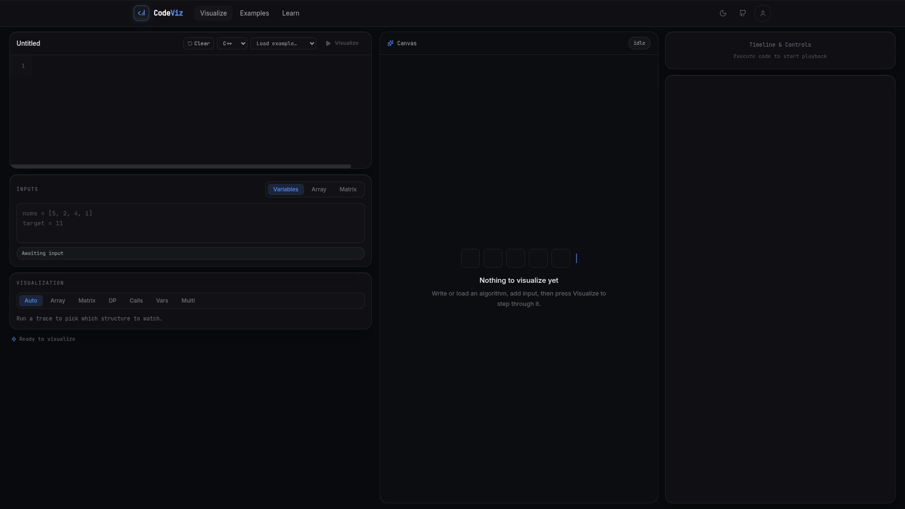
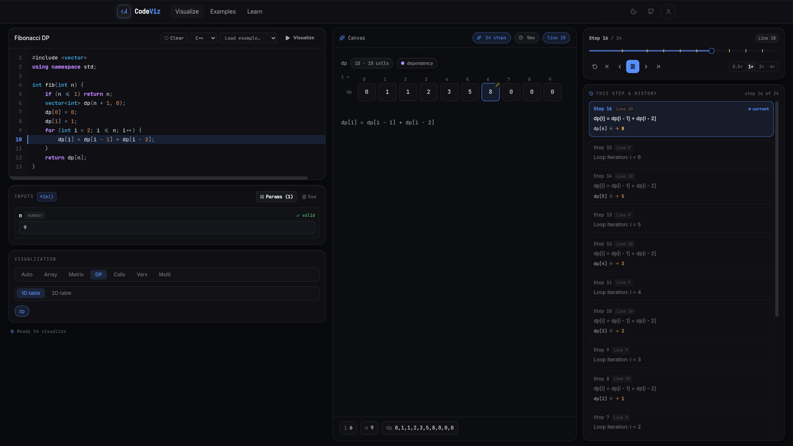

# CodeViz

<div align="center">
  <p align="center">
    <strong>See your algorithm run. Step through code and watch state change in real time.</strong>
  </p>
  <p align="center">
    <a href="#features">Features</a> •
    <a href="#visualization-modes">Visualization Modes</a> •
    <a href="#tech-stack">Tech Stack</a> •
    <a href="#getting-started">Getting Started</a> •
    <a href="#project-structure">Architecture</a>
  </p>
</div>

---

<!-- Screenshot Placeholder: Hero / Landing Overview -->
<div align="center">
  
  <p><em>Interactive landing experience with live step-by-step algorithm animation</em></p>
</div>

## Overview

**CodeViz** is a visual debugger and algorithm execution visualizer built for understanding code execution rather than just viewing the final output. 

Instead of mentally parsing complex loops, recursion trees, and state transitions, CodeViz instruments algorithm source code, captures a deterministic execution trace, and renders every state change—array cell mutations, pointer movements, dynamic programming table fills, and call stack frames—step by step.

---

<!-- Screenshot Placeholder: Interactive Workspace -->
<div align="center">
  
  <p><em>CodeViz Workspace: Synchronized Code Editor, Visualizer Canvas, and Timeline Scrubber</em></p>
</div>

---

## ✨ Features

- **⚡ Real-Time In-Browser Execution & Tracing**: Step forwards, backwards, or scrub smoothly across the full algorithm lifecycle.
- **🎯 Dynamic Data Structure Canvas**:
  - **1D & 2D Arrays**: Watch indices, value swaps, comparisons, and window bounds update with smooth visual transitions.
  - **Dynamic Programming Tables**: Inspect memoization grids with highlighted cell dependencies and transitions.
  - **Matrices & Grids**: Visualize 2D pathfinding and matrix transformations.
  - **Recursion & Call Trees**: Observe call stacks unfold, resolve return values, and collapse back.
  - **Variable Inspector**: Track scalar variables and loop indices across every step.
- **🔍 Multi-Language Support**: Write algorithms in **JavaScript**, **TypeScript**, and **Python**.
- **⏱️ Scrubbable Timeline**: Scrub precisely to any execution step, jump between mutation events, or adjust playback speed.
- **🎨 Apple-Grade Minimalist UI**: Sleek dark-mode aesthetic with glassmorphic accents, responsive design, and smooth animations.
- **📚 Curated Algorithm Library**: Pre-built, annotated traces for Sorting, Binary Search, Sliding Window, Kadane's Algorithm, Knapsack DP, LIS, BFS, and DFS.

---

<!-- Screenshot Placeholder: Algorithm Types & DP Table Visualizer -->
<div align="center">
  
  <p><em>Dynamic Programming and Recursion Visualizers with state dependency tracking</em></p>
</div>

---

## 🧩 Visualization Modes

| Mode | Target Structure | Ideal For |
| :--- | :--- | :--- |
| **Array Visualizer** | `1D Array / Pointers` | Two pointers, Sliding Window, Sorting, Binary Search |
| **DP Matrix** | `2D DP Table` | 0/1 Knapsack, LCS, Edit Distance, Grid Paths |
| **Recursion Tree** | `Call Stack / Tree` | Divide & Conquer, Tree Traversals, Backtracking, Fibonacci |
| **Matrix Grid** | `2D Matrix` | Flood Fill, Island Count, Matrix Rotations |
| **Variable Inspector** | `Scalar State` | Loop counters, accumulated sums, max/min trackers |

---

## 🛠️ Tech Stack

- **Framework**: [TanStack Start](https://tanstack.com/start) / [TanStack Router](https://tanstack.com/router)
- **UI & Components**: [React 19](https://react.dev/), [Radix UI](https://www.radix-ui.com/), [Lucide Icons](https://lucide.dev/)
- **Styling**: [Tailwind CSS v4](https://tailwindcss.com/) with custom design system tokens
- **Animation & Scrolling**: [Lenis](https://lenis.darkroom.engineering/) for smooth scrolling & micro-animations
- **Code Parsing & AST**: [Acorn](https://github.com/acornjs/acorn) for client-side JavaScript / TypeScript analysis
- **State Management**: React Context + Custom Reducer Event Store
- **Build Tool**: [Vite 6](https://vitejs.dev/)

---

## 🚀 Getting Started

### Prerequisites

- **Node.js** (v18.19.0+ or v20+)
- **npm**, **pnpm**, or **bun**

### Installation

```bash
# Clone the repository
git clone https://github.com/your-username/CodeViz.git

# Navigate to project directory
cd CodeViz

# Install dependencies
npm install
```

### Development Server

Start the local development server:

```bash
npm run dev
```

Open [http://localhost:8080](http://localhost:8080) (or the port shown in your terminal) in your browser.

### Building for Production

```bash
npm run build
```

Preview the production build:

```bash
npm run preview
```

---

## 📁 Project Structure

```
CodeViz/
├── public/                     # Static assets (favicons, manifest, icons)
│   ├── favicon.svg             # CodeViz SVG vector logo
│   └── favicon.ico             # CodeViz multi-resolution ICO
├── src/
│   ├── components/
│   │   ├── editor/             # Code editor & visualization configuration panels
│   │   ├── execution/          # Playback controls, timeline scrubber, explanations
│   │   ├── landing/            # Hero, interactive demo, feature breakdown sections
│   │   ├── layout/             # Navigation header, Logo, Footer
│   │   ├── ui/                 # Radix primitives and styled CV design components
│   │   └── visualization/      # Array, DP, Matrix, and Recursion visualizers
│   ├── data/                   # Mock and pre-calculated algorithm traces
│   ├── engine/                 # Client-side AST tracer, transpiler & interpreter
│   ├── hooks/                  # Custom React hooks (theme, smooth scroll, trace player)
│   ├── routes/                 # TanStack file-based routing
│   │   ├── __root.tsx          # Root shell, layout, and global meta tags
│   │   ├── index.tsx           # Landing page
│   │   ├── visualize.tsx       # Main interactive visualizer workspace
│   │   ├── examples.tsx        # Algorithm library & catalog
│   │   ├── learn.tsx           # Educational visual explanations
│   │   └── about.tsx           # About CodeViz
│   ├── state/                  # Workspace context & execution store
│   ├── styles.css              # Tailwind CSS configuration & design tokens
│   └── types/                  # TypeScript definitions for execution & languages
├── package.json
└── vite.config.ts
```

---

## 🤝 Contributing

Contributions, issues, and feature requests are welcome!

1. Fork the Project
2. Create your Feature Branch (`git checkout -b feature/AmazingFeature`)
3. Commit your Changes (`git commit -m 'Add some AmazingFeature'`)
4. Push to the Branch (`git push origin feature/AmazingFeature`)
5. Open a Pull Request

---

## 📄 License

Distributed under the MIT License. See `LICENSE` for more information.
